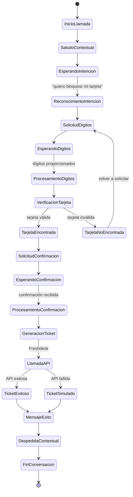
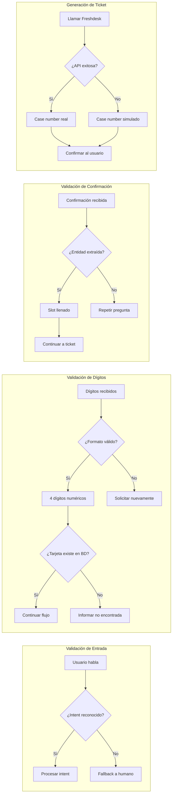
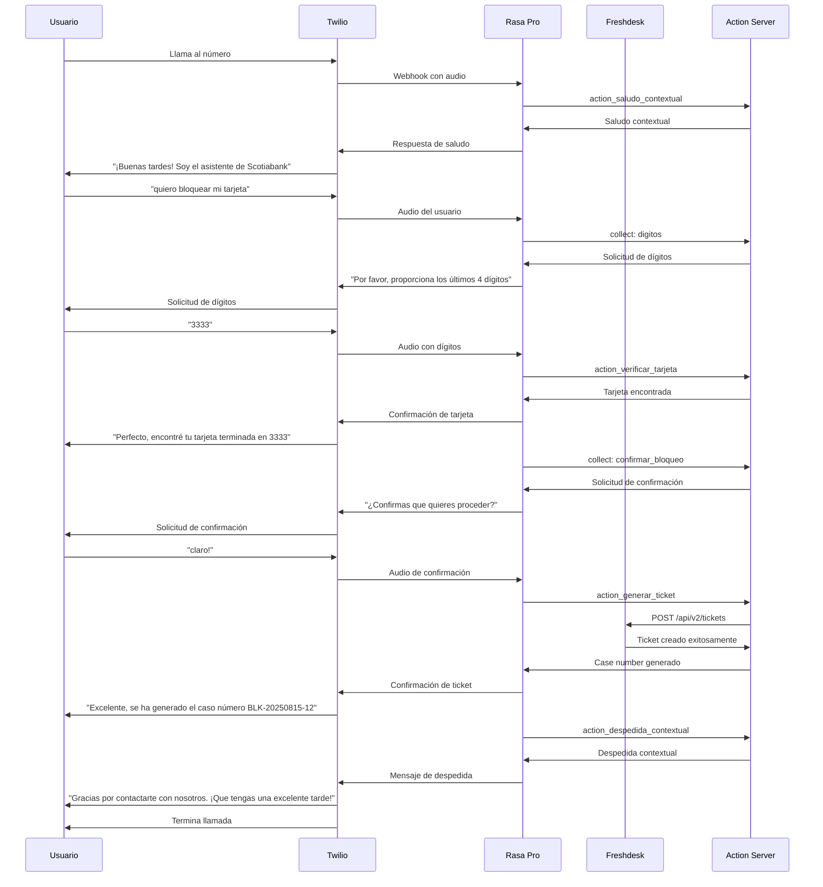
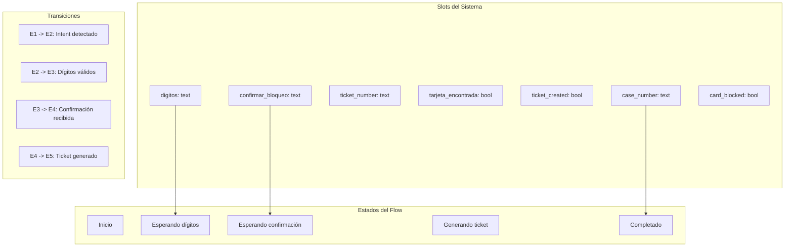

# 🔄 Flujo Conversacional - Bot de Bloqueo de Tarjetas SCTBNK Voice

## 📊 Diagrama del Flujo Principal

```mermaid
flowchart TD
    A[Cliente Llama al Número] --> B[Twilio Recibe Llamada]
    B --> C[Webhook a Rasa Pro]
    C --> D[Inicio del Flow: bloqueo_tarjeta]
    
    D --> E[action_saludo_contextual]
    E --> F[¡Buenas tardes! Soy el asistente de Scotiabank, ¿en qué puedo ayudarte?]
    
    F --> G[Usuario: "quiero bloquear mi tarjeta"]
    G --> H[Intent: bloquear_tarjeta detectado]
    H --> I[Flow activado automáticamente]
    
    I --> J[collect: digitos]
    J --> K[Por favor, proporciona los últimos 4 dígitos de la tarjeta que quieres bloquear]
    
    K --> L[Usuario proporciona dígitos]
    L --> M[Entidad: digitos extraída]
    M --> N[Slot: digitos llenado]
    
    N --> O[action_verificar_tarjeta]
    O --> P{¿Tarjeta encontrada?}
    
    P -->|Sí| Q[Perfecto, encontré tu tarjeta terminada en {digitos}. Ahora voy a generar un ticket para el bloqueo. ¿Te parece bien proceder?]
    P -->|No| R[No encontré una tarjeta con esos últimos 4 dígitos. ¿Podrías verificar y proporcionarme los dígitos correctos?]
    
    R --> S[Volver a collect: digitos]
    S --> K
    
    Q --> T[collect: confirmar_bloqueo]
    T --> U[¿Confirmas que quieres proceder con el bloqueo de tu tarjeta?]
    
    U --> V[Usuario confirma]
    V --> W[Entidad: confirmar_bloqueo extraída]
    W --> X[Slot: confirmar_bloqueo llenado]
    
    X --> Y[action_generar_ticket]
    Y --> Z[Llamada a Freshdesk API]
    
    Z --> AA{¿API Freshdesk exitosa?}
    
    AA -->|Sí| BB[Case number generado: BLK-YYYYMMDD-ID]
    AA -->|No| CC[Case number simulado: BLK-YYYYMMDD-SIM-UUID]
    
    BB --> DD[Excelente, se ha generado el caso número {case_number}. En instantes un ejecutivo realizará el bloqueo de tu tarjeta.]
    CC --> DD
    
    DD --> EE[action_despedida_contextual]
    EE --> FF[Despedida según la hora del día]
    
    FF --> GG[Gracias por contactarte con nosotros. ¡Que tengas un excelente día/tarde/noche!]
    GG --> HH[Conversación terminada]
    
    style A fill:#e1f5fe
    style D fill:#f3e5f5
    style Y fill:#fff3e0
    style HH fill:#c8e6c9
```

## 🔄 Flujo Detallado con Estados



## 🎯 Puntos de Decisión y Validación



## 📱 Flujo de Interacción por Pasos



## 🔍 Estados del Sistema y Slots



## 📋 Resumen del Flujo

### **1. Inicio de Llamada** 📞
- Cliente llama al número configurado en Twilio
- Twilio envía webhook a Rasa Pro
- Se activa el flow `bloqueo_tarjeta`

### **2. Saludo Contextual** 👋
- `action_saludo_contextual` determina la hora del día
- Genera saludo apropiado (buenos días, tardes, noches)
- Solicita al usuario que indique su necesidad

### **3. Reconocimiento de Intención** 🎯
- Usuario expresa deseo de bloquear tarjeta
- NLU detecta intent `bloqueo_tarjeta`
- Flow se activa automáticamente

### **4. Solicitud de Dígitos** 🔢
- `collect: digitos` solicita últimos 4 dígitos
- Usuario proporciona dígitos
- Entidad `digitos` se extrae y mapea al slot

### **5. Verificación de Tarjeta** ✅
- `action_verificar_tarjeta` valida dígitos
- Simula consulta a base de datos
- Confirma tarjeta encontrada

### **6. Solicitud de Confirmación** 🤔
- `collect: confirmar_bloqueo` solicita confirmación
- Usuario confirma con múltiples variaciones
- Entidad `confirmar_bloqueo` se extrae y mapea

### **7. Generación de Ticket** 🎫
- `action_generar_ticket` llama a Freshdesk API
- Genera case number profesional (BLK-YYYYMMDD-ID)
- Fallback a case number simulado si API falla

### **8. Despedida y Finalización** 👋
- `action_despedida_contextual` genera despedida
- Mensaje contextual según la hora
- Conversación termina limpiamente

## 🚀 Características del Flujo

- **✅ Robusto**: Maneja fallos de API con fallbacks
- **🔄 Adaptativo**: Se adapta a diferentes formas de confirmación
- **📱 Natural**: Conversación fluida y natural
- **🔒 Seguro**: Solo requiere últimos 4 dígitos
- **📊 Rastreable**: Cada interacción genera logs y tickets
- **🌐 Escalable**: Arquitectura preparada para producción

---

**Este flujo conversacional está completamente implementado y funcional en el sistema actual.** 🎉
