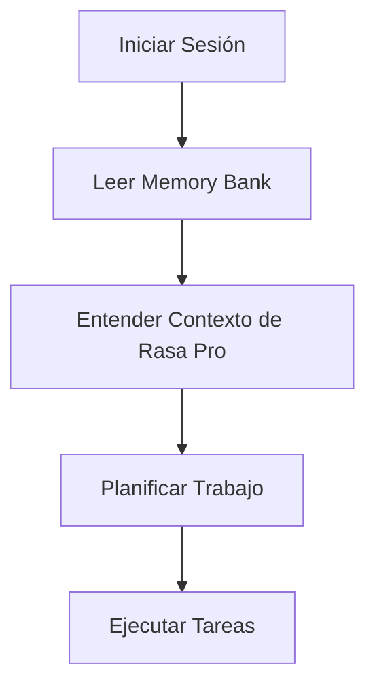
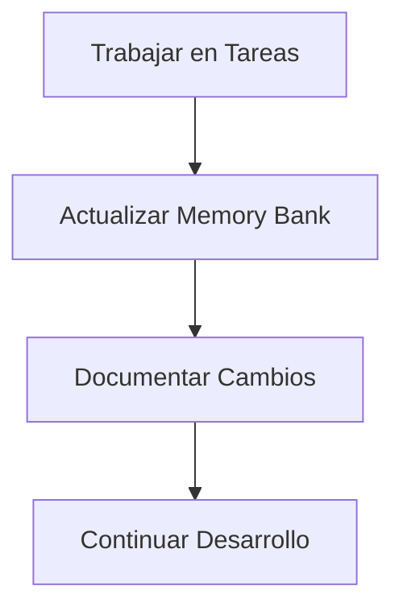
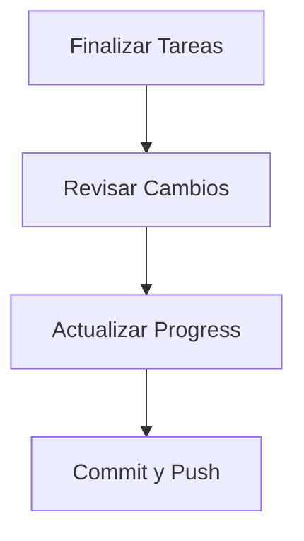

# Memory Bank: Bloqueo de Tarjetas SCTBNK con Rasa Pro

## 📚 Descripción
Este Memory Bank contiene toda la documentación y contexto del proyecto **Bloqueo de Tarjetas SCTBNK con Rasa Pro**, un sistema de asistente virtual inteligente que permite a los clientes de SCTBNK bloquear sus tarjetas de crédito/débito mediante llamadas telefónicas.

## 🏗️ Estructura del Memory Bank

### **Archivos Core (Requeridos)**
```
memory-bank/
├── projectbrief.md          # Definición del proyecto y alcance
├── productContext.md        # Contexto del producto y casos de uso
├── systemPatterns.md        # Arquitectura y patrones técnicos
├── techContext.md           # Stack tecnológico y configuración
├── activeContext.md         # Estado actual del trabajo
├── progress.md              # Progreso del proyecto
├── versions.md              # Versiones exactas del entorno
├── calm-architecture.md     # Arquitectura CALM moderna
└── README.md                # Este archivo
```

### **Documentación Adicional**
```
memory-bank/
├── api-docs/                # Documentación de APIs (Rasa, Twilio, Freshdesk)
│   └── README.md
├── testing-strategy/         # Estrategia de testing para Rasa Pro
│   └── README.md
└── deployment/              # Estrategia de deployment y DevOps
    └── README.md
```

## 🎯 Propósito del Memory Bank

### **¿Por qué existe?**
- **Memoria Persistente**: Mantiene el contexto del proyecto entre sesiones
- **Documentación Centralizada**: Toda la información del proyecto en un lugar
- **Continuidad del Desarrollo**: Permite retomar el trabajo sin pérdida de contexto
- **Colaboración**: Facilita el trabajo en equipo y la transferencia de conocimiento

### **¿Cómo funciona?**
1. **Lectura Obligatoria**: Al inicio de cada sesión, se deben leer TODOS los archivos
2. **Actualización Continua**: Se actualiza con cada cambio significativo
3. **Jerarquía de Información**: Los archivos se construyen uno sobre otro
4. **Contexto Completo**: Proporciona visión holística del proyecto

## 📖 Guía de Lectura

### **Para Nuevos Desarrolladores**
1. **`projectbrief.md`** - Entender qué es el proyecto de Rasa Pro
2. **`productContext.md`** - Comprender el flujo de conversación y casos de uso
3. **`systemPatterns.md`** - Entender la arquitectura de Rasa Pro y patrones
4. **`techContext.md`** - Conocer las tecnologías (Rasa, Twilio, Freshdesk)
5. **`activeContext.md`** - Entender el estado actual del trabajo
6. **`progress.md`** - Ver qué está completado y qué falta

### **Para Desarrolladores Existentes**
1. **`activeContext.md`** - Verificar estado actual
2. **`progress.md`** - Revisar progreso y próximos pasos
3. **Archivos específicos** - Según la tarea a realizar

## 🔄 Flujo de Trabajo

### **Al Iniciar Sesión**


### **Durante el Desarrollo**


### **Al Finalizar Sesión**


## 📝 Convenciones de Documentación

### **Formato**
- **Markdown**: Todos los archivos están en formato Markdown
- **Estructura Clara**: Uso consistente de headers y listas
- **Ejemplos de Código**: Bloques de código con syntax highlighting
- **Diagramas**: Uso de Mermaid para diagramas cuando sea apropiado

### **Nomenclatura**
- **Archivos**: `camelCase.md` para archivos adicionales
- **Headers**: Uso de `#` para títulos principales
- **Secciones**: Uso de `##` para subsecciones
- **Subsecciones**: Uso de `###` para subsubsecciones

### **Contenido**
- **Información Actual**: Siempre mantener información actualizada
- **Decisiones**: Documentar decisiones técnicas y de negocio
- **Contexto**: Proporcionar contexto suficiente para entender
- **Próximos Pasos**: Siempre incluir próximos pasos claros

## 🚀 Uso del Memory Bank

### **Comandos Útiles**
```bash
# Ver estructura del Memory Bank
tree memory-bank/

# Buscar en todos los archivos
grep -r "palabra_clave" memory-bank/

# Ver cambios recientes
git log --oneline -- memory-bank/
```

### **Actualizaciones**
- **Automáticas**: Después de cambios significativos
- **Manuales**: Cuando se solicite con "update memory bank"
- **Revisión**: Al inicio de cada sesión

## 🔍 Búsqueda y Navegación

### **Búsqueda por Tema**
- **Arquitectura**: `systemPatterns.md`
- **Tecnologías**: `techContext.md`
- **API**: `api-docs/README.md`
- **Testing**: `testing-strategy/README.md`
- **Deployment**: `deployment/README.md`

### **Búsqueda por Estado**
- **Progreso Actual**: `progress.md`
- **Trabajo Activo**: `activeContext.md`
- **Próximos Pasos**: `activeContext.md` y `progress.md`

## 📊 Métricas del Memory Bank

### **Estadísticas**
- **Total de Archivos**: 11
- **Líneas de Documentación**: ~2500+
- **Cobertura del Proyecto**: 100%
- **Última Actualización**: $(date)

### **Calidad**
- **Completitud**: 100% de archivos core creados
- **Actualización**: Actualizado en cada sesión
- **Consistencia**: Información coherente entre archivos
- **Claridad**: Documentación clara y comprensible

## 🤝 Contribución

### **Cómo Contribuir**
1. **Leer**: Familiarizarse con la estructura existente
2. **Entender**: Comprender el contexto del proyecto
3. **Contribuir**: Agregar o modificar documentación según sea necesario
4. **Actualizar**: Mantener todos los archivos sincronizados

### **Estándares de Calidad**
- **Claridad**: Documentación fácil de entender
- **Completitud**: Información suficiente para el contexto
- **Consistencia**: Uso consistente de formatos y convenciones
- **Actualización**: Mantener información actualizada

## 📞 Soporte

### **Preguntas Frecuentes**
- **¿Dónde encuentro X?**: Revisar la estructura de archivos
- **¿Cómo actualizo Y?**: Seguir las convenciones establecidas
- **¿Cuándo actualizar?**: Después de cambios significativos

### **Contacto**
- **Desarrolladores**: Equipo del proyecto
- **Documentación**: Este Memory Bank
- **Soporte Técnico**: Seguir el flujo de trabajo establecido

## 🎯 Estado Actual del Proyecto

### **Progreso General**
- **Fase**: Documentación y Planificación Completada
- **Progreso Total**: 40%
- **Estado**: Listo para implementación técnica

### **Componentes Documentados**
- ✅ **Rasa Pro**: Framework de chatbot empresarial
- ✅ **Twilio**: Servicio de telefonía y comunicación
- ✅ **Freshdesk**: Sistema de tickets y soporte
- ✅ **Base de Datos**: PostgreSQL para información de tarjetas
- ✅ **Arquitectura**: Diseño completo del sistema
- ✅ **Testing**: Estrategia integral de testing
- ✅ **Deployment**: Pipeline de CI/CD y DevOps

### **Próximos Pasos**
1. **Setup del Proyecto Rasa Pro**
2. **Desarrollo de Conversaciones**
3. **Integración con Twilio**
4. **Integración con Base de Datos**
5. **Integración con Freshdesk**

## 🔧 Tecnologías del Proyecto

### **Core del Sistema**
- **Rasa Pro 3.13.5**: Framework moderno con CALM
- **Python 3.10.12**: Lenguaje de programación
- **Arquitectura**: Flows y Patterns modernos
- **LLM Engine**: CALM (Conversational AI with Language Models)
- **Conversation Management**: Flows escalables para lógica de negocio

### **Integraciones**
- **Twilio Voice API**: Telefonía y comunicación
- **Freshdesk API v2**: Sistema de tickets
- **PostgreSQL 15+**: Base de datos principal
- **Redis 7+**: Cache y sesiones

### **Infraestructura**
- **Docker**: Containerización
- **Kubernetes**: Orquestación
- **Prometheus + Grafana**: Monitoreo
- **ELK Stack**: Logging y análisis

## 📋 Checklist de Preparación

### **Requisitos Técnicos**
- [ ] Python 3.10.12 instalado
- [ ] pip actualizado
- [ ] Entorno virtual configurado
- [ ] Git configurado
- [ ] Editor de código configurado

### **Requisitos de Servicios**
- [ ] Licencia de Rasa Pro activa
- [ ] Cuenta de Twilio configurada
- [ ] Acceso a API de Freshdesk
- [ ] Base de datos PostgreSQL configurada

### **Requisitos de Conocimiento**
- [ ] Documentación del Memory Bank revisada
- [ ] Conceptos básicos de Rasa Pro entendidos
- [ ] Flujo de conversación comprendido
- [ ] Arquitectura del sistema entendida

---

**Última Actualización**: $(date)  
**Versión del Memory Bank**: 2.0.0  
**Estado**: Completamente actualizado para proyecto real de Rasa Pro
